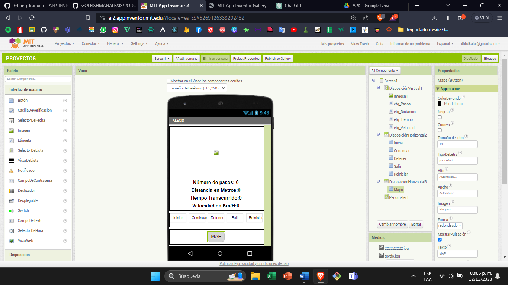
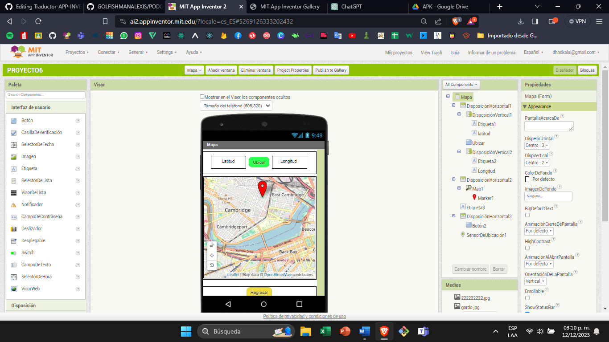
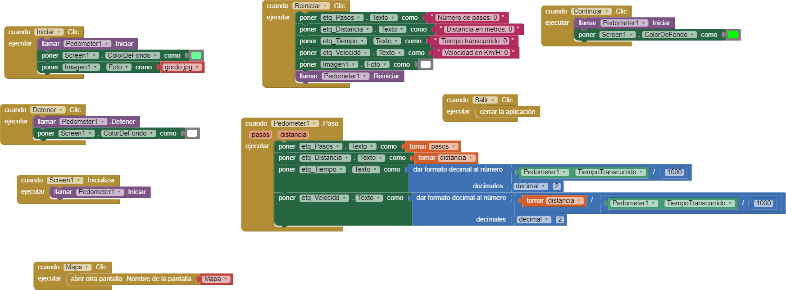
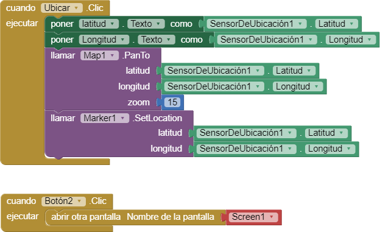

# PROYECTO 6 PODOMETRO

## 

## PROPOSITO

El propósito es saber como medir las distancias y ver cuanta has recorrido con el podómetro que esta integrado en la mayoría de los dispositivos electrónicos con varias funciones

## 

## Componentes de la app 1

### Disposición de la Pantalla Principal:

1.  **Imagen Principal**
2.  **Etiquetas:**
    1.  Etiqueta de Paso
    2.  Etiqueta de Velocidad
    3.  Etiqueta de Tiempo
    4.  Etiqueta de Distancia
3.  **Disposición Secundaria Horizontal:**
    1.  Cinco Botones:
        1.  Iniciar
        2.  Continuar
        3.  Detener
        4.  Salir
        5.  Reiniciar
    2.  Tercera Disposición Horizontal:
        1.  Botón para Cambiar a la Vista de Mapas
        2.  Podómetro (Parte Central)

### Disposición de la Pantalla 2:

1.  **Disposición Horizontal:**
    1.  Latitud y Longitud
    2.  Botón para Ubicar el Mapa y el Marcador (Sensor de Ubicación)
    3.  Botón de Regreso a la Pantalla Principal

## 

## 

## 

## 

## 

## 

## 

## 

## 

## BLOQUES pantalla 1

## FUNCIONAMIENTO BLOQUES PANTALLA 1

Con el podómetro registrado un paso largo 1 corto con las distancias y aplicó una fórmula para convertirlo en kilómetros y tiene un botón Inicializar la ventana del mapa

## 

## 

## 

## 

## 

## 

## 

## 

## BLOQUES PANTALLA 2

## 

## 

## 

## 

## FUNCIONAMIENTO BLOQUES PANTALLA 2

### Disposición de la Pantalla Principal:

1.  **Imagen Principal**
2.  **Etiquetas:**
    1.  Etiqueta de Paso
    2.  Etiqueta de Velocidad
    3.  Etiqueta de Tiempo
    4.  Etiqueta de Distancia
3.  **Disposición Secundaria Horizontal:**
    1.  Cinco Botones:
        1.  Iniciar
        2.  Continuar
        3.  Detener
        4.  Salir
        5.  Reiniciar
    2.  Tercera Disposición Horizontal:
        1.  Botón para Cambiar a la Vista de Mapas
        2.  Podómetro (Parte Central)

### Disposición de la Pantalla 2:

1.  **Disposición Horizontal:**
    1.  Latitud y Longitud
    2.  Botón para Ubicar el Mapa y el Marcador (Sensor de Ubicación) con un zoom del 15%
    3.  Botón para Llamar a la Localización y Centrarla Correctamente
    4.  Botón para Abrir la Pantalla Anterior

## 

## LINK DE GALERIA
<a href="https://gallery.appinventor.mit.edu/?galleryid=8404cce3-b559-47c3-b57e-8a46c4ed114c" style="text-decoration: none; display: inline-block; padding: 10px 20px; border: 2px solid #555; border-radius: 5px; background-color: #007bff; color: #fff; font-size: 16px;" rel="noopener">
  GALERÍA
</a>

## link de APK
<a href="https://drive.google.com/file/d/1iAlzW7utpeQ5OpoXYcSaL71drfg1rCVF/view?usp=sharing" style="text-decoration: none; display: inline-block; padding: 10px 20px; border: 2px solid #555; border-radius: 5px; background-color: #007bff; color: #fff; font-size: 16px;" rel="noopener">
  APK
</a>

